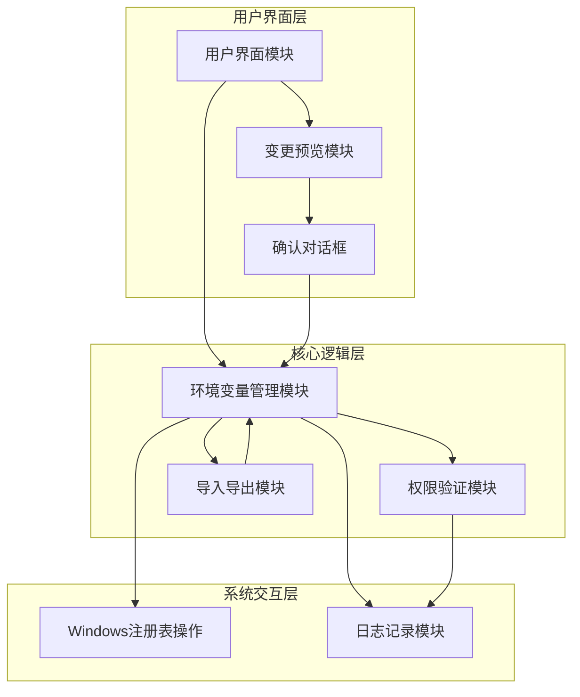
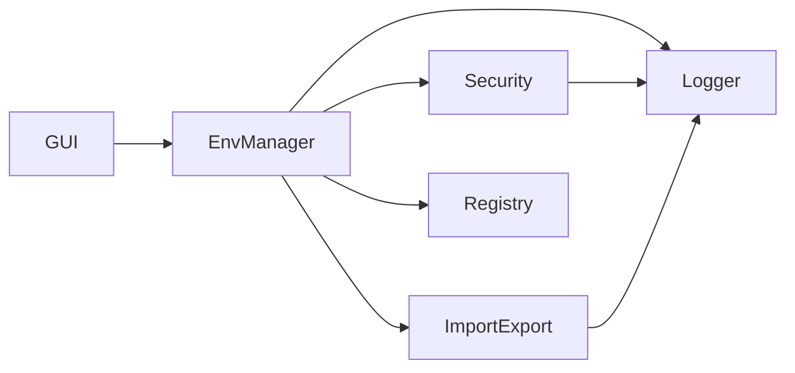
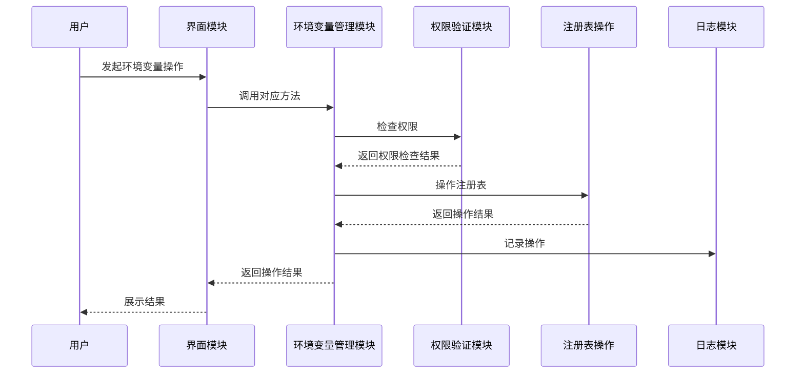

# 环境变量管理器项目设计文档

## 整体架构图

## 分层设计和核心组件

### 1. 用户界面层
- **GUI模块**：使用wxPython实现主界面，包含环境变量列表、操作按钮等
- **变更预览模块**：展示环境变量变更的前后对比
- **确认对话框**：用于用户确认变更操作

### 2. 核心逻辑层
- **环境变量管理模块**：实现环境变量的查看、添加、编辑、删除等核心功能
- **权限验证模块**：处理管理员权限请求和验证
- **导入导出模块**：实现环境变量的导入和导出功能

### 3. 系统交互层
- **Windows注册表操作**：通过winreg模块操作Windows注册表，实现环境变量的读写
- **日志记录模块**：记录应用程序的操作和错误信息

## 模块依赖关系图

## 接口契约定义

### 环境变量管理模块
- `get_environment_variables(scope)`: 获取指定作用域（系统/用户）的环境变量
  - 参数：scope (str): "system" 或 "user"
  - 返回：dict: 环境变量名和值的字典

- `add_environment_variable(name, value, scope)`: 添加环境变量
  - 参数：
    - name (str): 环境变量名
    - value (str): 环境变量值
    - scope (str): "system" 或 "user"
  - 返回：bool: 操作是否成功

- `update_environment_variable(name, value, scope)`: 更新环境变量
  - 参数：
    - name (str): 环境变量名
    - value (str): 新的环境变量值
    - scope (str): "system" 或 "user"
  - 返回：bool: 操作是否成功

- `delete_environment_variable(name, scope)`: 删除环境变量
  - 参数：
    - name (str): 环境变量名
    - scope (str): "system" 或 "user"
  - 返回：bool: 操作是否成功

### 权限验证模块
- `is_admin()`: 检查当前是否以管理员权限运行
  - 返回：bool: 是否具有管理员权限

- `request_admin()`: 请求管理员权限
  - 返回：bool: 是否成功获取管理员权限

- `check_environment_variable_safety(name)`: 检查环境变量是否安全（非系统关键变量）
  - 参数：name (str): 环境变量名
  - 返回：bool: 是否安全

### 导入导出模块
- `export_environment_variables(scope, format, file_path)`: 导出环境变量
  - 参数：
    - scope (str): "system" 或 "user" 或 "all"
    - format (str): "json" 或 "text"
    - file_path (str): 导出文件路径
  - 返回：bool: 操作是否成功

- `import_environment_variables(file_path, scope, overwrite)`: 导入环境变量
  - 参数：
    - file_path (str): 导入文件路径
    - scope (str): "system" 或 "user"
    - overwrite (bool): 是否覆盖现有环境变量
  - 返回：bool: 操作是否成功

## 数据流向图

## 异常处理策略

1. **权限不足**：
   - 系统级环境变量操作需要管理员权限
   - 权限不足时，尝试请求管理员权限
   - 若用户拒绝提升权限，则显示错误信息

2. **环境变量操作失败**：
   - 捕获Windows API错误
   - 记录详细错误信息到日志
   - 显示用户友好的错误提示

3. **文件操作错误**：
   - 导入/导出时的文件读写错误
   - 记录错误信息到日志
   - 显示用户友好的错误提示

4. **安全检查失败**：
   - 尝试修改系统关键环境变量时
   - 显示警告信息，要求用户确认
   - 记录操作到日志
