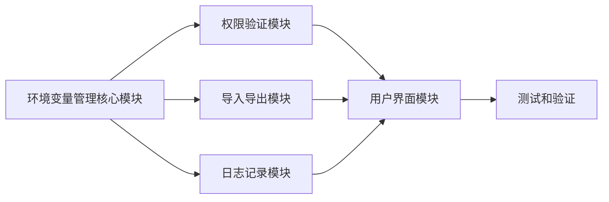

# 环境变量管理器项目任务拆分文档

## 任务依赖图

## 任务拆分

### 任务1：环境变量管理核心模块

**输入契约**：
- Python 3.8+ 环境
- Windows 10+ 操作系统
- winreg 模块

**输出契约**：
- `env_manager.py` 文件，包含环境变量管理核心逻辑
- 支持查看、添加、编辑、删除环境变量的功能

**实现约束**：
- 使用 winreg 模块操作 Windows 注册表
- 支持系统级和用户级环境变量
- 提供清晰的函数接口

**依赖关系**：
- 无前置依赖
- 后置依赖：权限验证模块、导入导出模块、用户界面模块

### 任务2：权限验证模块

**输入契约**：
- Python 3.8+ 环境
- ctypes 模块

**输出契约**：
- `security.py` 文件，包含权限验证和安全检查逻辑
- 支持管理员权限检查和请求
- 支持环境变量安全检查

**实现约束**：
- 使用 ctypes 模块请求管理员权限
- 对系统关键环境变量进行特殊保护

**依赖关系**：
- 无前置依赖
- 后置依赖：用户界面模块

### 任务3：导入导出模块

**输入契约**：
- Python 3.8+ 环境
- json 模块

**输出契约**：
- `import_export.py` 文件，包含导入导出功能
- 支持导出到 JSON 和文本文件
- 支持从 JSON 和文本文件导入

**实现约束**：
- 导出格式清晰易读
- 导入时进行格式验证

**依赖关系**：
- 前置依赖：环境变量管理核心模块
- 后置依赖：用户界面模块

### 任务4：日志记录模块

**输入契约**：
- Python 3.8+ 环境
- logging 模块

**输出契约**：
- `logger.py` 文件，包含日志记录功能
- 支持不同级别的日志记录
- 日志文件自动轮转

**实现约束**：
- 日志格式规范
- 日志级别可配置

**依赖关系**：
- 无前置依赖
- 后置依赖：用户界面模块

### 任务5：用户界面模块

**输入契约**：
- Python 3.8+ 环境
- wxPython 库
- 前置任务的所有模块

**输出契约**：
- `gui.py` 文件，包含用户界面实现
- 主窗口、环境变量列表、操作按钮
- 变更预览和确认对话框

**实现约束**：
- 使用 wxPython 构建界面
- 界面友好且操作直观
- 响应迅速

**依赖关系**：
- 前置依赖：环境变量管理核心模块、权限验证模块、导入导出模块、日志记录模块
- 后置依赖：测试和验证

### 任务6：测试和验证

**输入契约**：
- 所有前置任务的实现
- Windows 10+ 操作系统

**输出契约**：
- 功能测试结果
- 性能测试结果
- 兼容性测试结果

**实现约束**：
- 测试覆盖关键功能
- 测试边界条件
- 测试异常情况

**依赖关系**：
- 前置依赖：用户界面模块
- 无后置依赖
